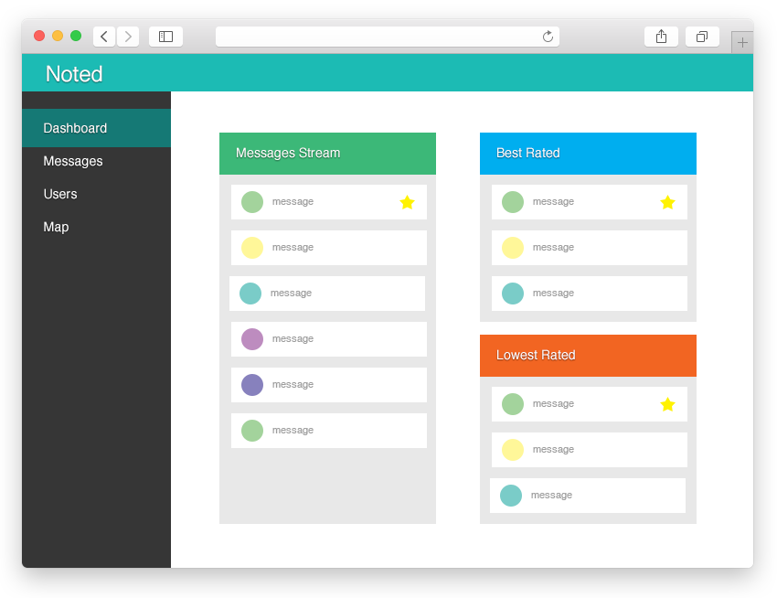

 Notted
========

Notted is a mobile application thet will provide a company's field agent with extra information about their surroundings.


## What does *Notted* trying to solve?
Imagine a company, **SoftDrinks Co.** that provides soft drinks to the majority of restaurants in Tel Aviv area.

"SoftDrinks Co." has **5 salesmen** that making deals around town, and **3 truck drivers** that deliver the goods to each location on a weekly basis.

Every salesman has a unique knowledge about each client, and this knowledge helps him make better deals.

Every truck driver, knows the area he delivers to, and understand each venue needs.

#### This information is not shared!

If a one of the salesman resign, it will be **very hard for a new employee** to take his place.

If there is an important knowledge a truck driver knows about a venue, it wouldn't be able to share with his/hers peers!

## How do we solve the problem?
Introducing: **Notted**

Notted is a mobile application that uses GPS location to help your company's field agents **communicate better**!

With notted, each employee could leave "notes" attached to each location on a map for other agents to read later.

If there is important note in your area, *Notted* will send you a notification about it!


## Features
#### Mobile app
The mobile app will let users leave location based notes, and read notes that are close to them.

Every note could then be rated for relevance, thus decides wether it is of importance.


#### Administration Console
The administration console will let any user view their message, and edit them.

It will also allow managers to add new users, reset their passwords, and manage messages though out the system.

## Our target audience
We are addressing companies that have field agents operation. To name a few, sales agencies, delivery agencies, services providers etc.

## Analysis similar applications 

**PopNotes** is an application that allows you to place sticky notes anywhere you want and share with friends and family.

You can control who gets to see the notes you post – just yourself, your friends and family or anyone with the app, Invite friends and family to connect through the app, view notes posted by you and others within 500 yards of your current location via an interactive map and Set location-based reminders anywhere in the U.S.

#### Similarity: 

Both Apps useful to share knowledge and information by notes, and allows users to leave notes by location.

#### Differences:

* **Notted** is Intended to companies and PopNotes is for everybody.
* The notes in **Notted** is about tips and helpful information in work.
* The notes in **PopNotes** can be about everything even a song or a joke someone wrote to another and he wanted him to see in a place she is in. 
* The manager in **PopNotes** is the user every user is responsible on his profile while in **Notted** there are managers that manage and control the system.



## Data Schema

```
// COMPANY 
var company = {
	_id: int,
	name: string
}
```

```
// USERS
var user = {
	_id: int,
	email: string,
	name: string,
	password: string,
	company: int,
	privileges: string,
	dateCreated: timestamp,
	dateUpdated: timestamp
}
```

```
// NOTES
var note = {
	_id: int,
	user: int,
	content: {
		locationHint: string,
		note: string
	}
	location: {
		lng: long,
		lat: long
	},
	dateCreated: timestamp,
	dateUpdated: timestamp
}
```

```
// VOTES
var votes = {
	_id: int,
	user: int,
	note: int,
	type: int, // 1 for an upvote, -1 for a downvote
}
```

## Common queries

#### Display all the notes in a specific location:

When a user is in a location who has notes written by his coworkers and can be helpful to him, all the notes needs to pop-up.

Also the user can choose any location he wants and see all the relevant notes.

#### Get user vote on a chosen note:

When the user reads a note, he has the ability to upvote or downvote the note.

The query will determine whether the user has already voted this note, and display the right icon in the client application.


#### Display all the users in a company:

Each company has one person or more that have the privileges to add, remove and update data of users in their company.

The query will provide with all the users of the company and will allow displaying them and edit their info.

#### Display all the company's notes:

The manager needs to view all the notes of the company he is responsible of.
The notes could be sorted by description, votes, location and etc. 
He needs to supervise the system and make sure the notes written are of standard.

Also it is important to make sure all the notes are reliable, sorting the list of the notes by 
votes can display it and he could remove the irrelevant notes.

#### Display user's notes and votes: 

User can see all his notes he has written. He can update and remove any note he wants.
